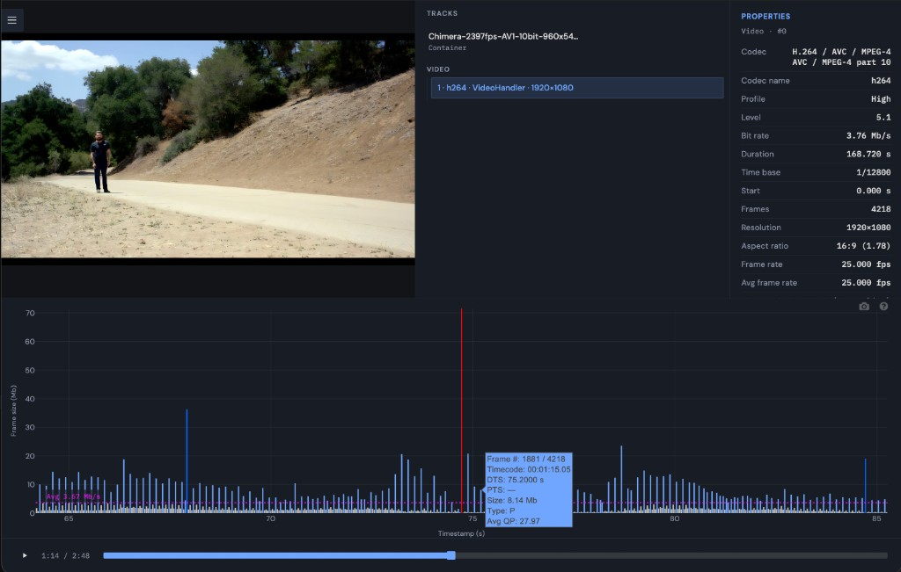

# VidPlot

Local video frame analyzer for inspecting per-frame size, frame type (I/P/B), timestamps (DTS/PTS), and average QP. Drop a clip, scrub with JKL / frame-step keys, and explore the bitrate graph next to a video preview.



## Features

- Drag-and-drop, native file open (desktop), or HTTP(S) URL (ffprobe/ffmpeg stream the remote file)
- Staged analysis: streams/properties → frame chart → QP (when available)
- Per-frame hover: frame number, timecode, DTS, PTS, size, type, Avg QP
- JKL shuttle, Space play/pause, `,` / `.` (or `<` / `>`) frame step, arrow keys ±1s
- Optional desktop app via pywebview + PyInstaller

## Prerequisites

- Python 3.10+ recommended
- [FFmpeg](https://ffmpeg.org/) (provides `ffprobe` and `ffmpeg` on your `PATH`)

### Install FFmpeg

**macOS**

```bash
brew install ffmpeg
```

**Ubuntu / Debian**

```bash
sudo apt update
sudo apt install ffmpeg
```

**Windows**

Download from the [FFmpeg site](https://ffmpeg.org/download.html) and add it to your system `PATH`.

## Setup

```bash
git clone https://github.com/Oren-Beamr/VidPlot.git
cd VidPlot

python -m venv venv
source venv/bin/activate   # Windows: venv\Scripts\activate

pip install -r requirements.txt
```

## Run

### Desktop (recommended)

```bash
python desktop.py
```

### Browser / Flask

```bash
python app.py
```

Then open [http://localhost:5000](http://localhost:5000).

## Build a desktop app

```bash
python build_desktop.py
```

Output lands under `dist/` (platform-specific). Paths for `ffprobe` / `ffmpeg` can also be set in the in-app Configure menu.

## Usage

1. Open a video (drag-and-drop, file picker, or paste an `http://` / `https://` URL).
2. Wait for properties, then the frame graph (QP fills in when supported).
3. Hover bars for frame details; use keyboard shortcuts to scrub and shuttle.

Remote URLs are probed in place (no download copy). Preview playback uses the URL directly in the video element, so the host must allow media access from the app.

## License

See repository for license details.
