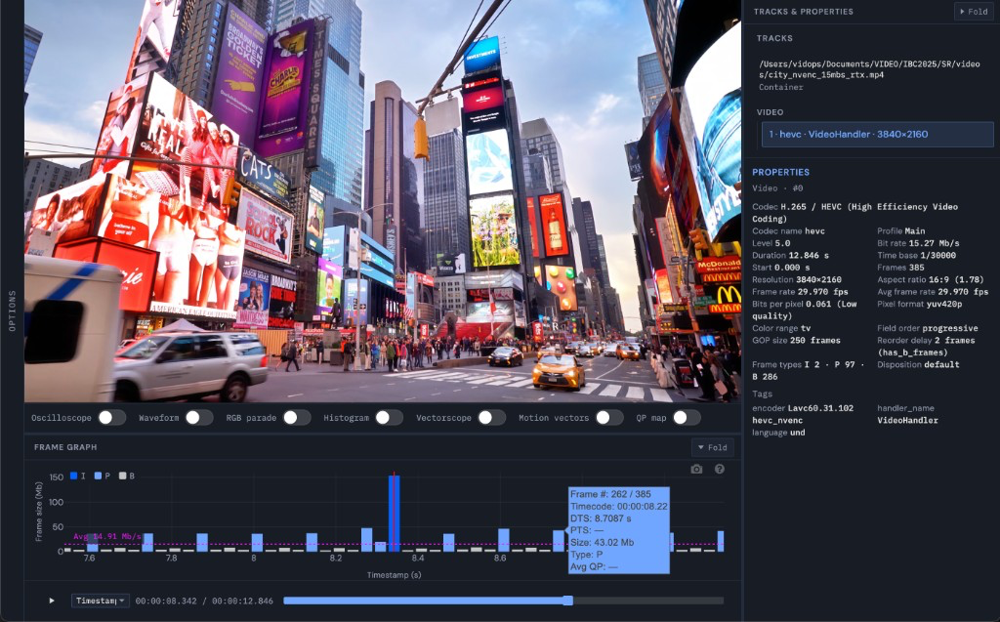
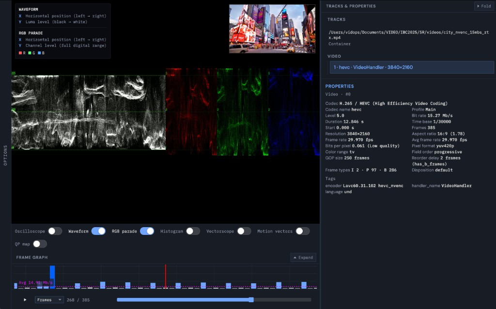
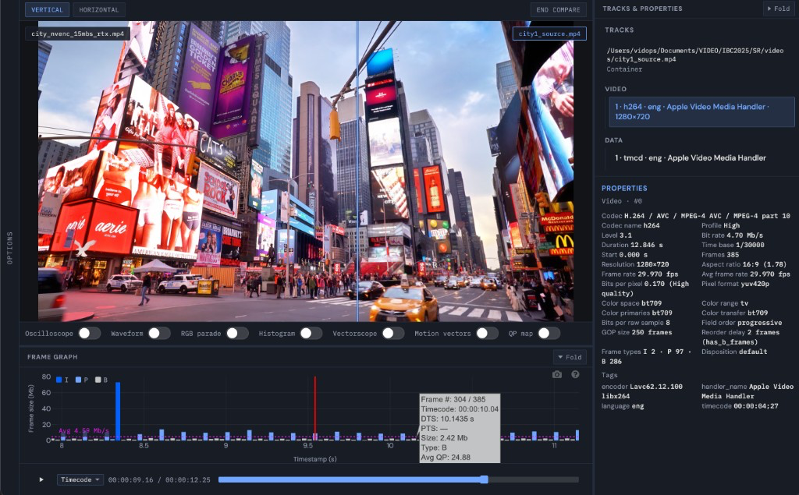
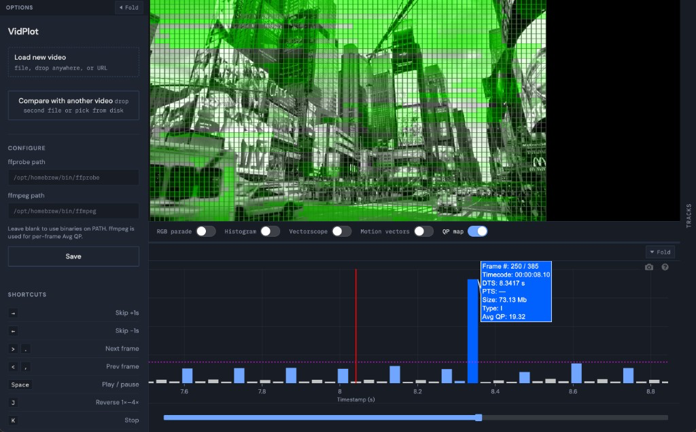

# VidPlot

Local video analyzer for engineers and QC: inspect **per-frame size**, **frame type** (I/P/B), **timestamps**, **average QP**, and **scopes** next to a synced preview — without uploading your files to the cloud.



## Frame graph & transport

See how every frame is encoded, not just the headline bitrate.

- **Per-frame bar chart** — size in Mb/s, color-coded **I**, **P**, and **B**
- **Hover tooltip** — frame index, timecode, DTS/PTS, size, type, and Avg QP when available
- **Synced playback** — scrub the graph or use the seek bar; playhead stays aligned with the video
- **JKL shuttle**, Space play/pause, comma/period frame step, arrow keys ±1s
- **Time display** — seconds, timecode, timestamp, or frame index
- **Zoom** the graph to inspect short GOPs or spikes

## Tracks & properties

Container and stream metadata from ffprobe, plus analysis derived from the frame pass.

- **Track tree** — video, audio, captions; click a stream for detail
- **Properties** — codec, profile/level, resolution, frame rate, pixel format, color metadata, GOP size, reorder delay, frame-type counts, bit rate, encoder tags
- **Resizable layout** — properties rail full height; frame graph under the preview

## Broadcast scopes

Toggle analyzers under the preview. FFmpeg renders scopes at the current frame; waveform, parade, histogram, and vectorscope can show a **live PiP** of the picture for reference.



| Scope          | What it shows                                    |
| -------------- | ------------------------------------------------ |
| Oscilloscope   | 2D trace of levels along a line in the frame     |
| Waveform       | Luma levels across columns                       |
| RGB parade     | R, G, B waveforms side by side                   |
| Histogram      | Overlapping R/G/B level distribution             |
| Vectorscope    | Chrominance (U vs V)                             |
| Motion vectors | FFmpeg codecview motion arrows (codec-dependent) |
| QP map         | Per-macroblock QP tint + grid (H.264/VP9, etc.)  |

Hard codecs (e.g. ProRes) use an ffmpeg→canvas preview path so scopes and scrubbing still work when the browser cannot decode the file natively.

## Wipe compare

Drop or pick a **second clip** while one is already open — choose **Compare with existing** — and scrub both in sync behind a draggable wipe.



- **Vertical or horizontal** wipe divider (thin line, easy to drag)
- **Labels** on each side with the file name
- **Click** a side to show that clip in **Tracks & properties** and the frame graph
- **Scopes apply to both** videos at the same timecode
- **Zoom and pan** on the compare view; **double-click** for fullscreen
- **End compare** returns to single-clip mode

## Options & desktop shell

Electron desktop app with a bundled analysis server. Open local paths without copying files; optional HTTP(S) URLs are probed in place.



- **Load new video** or **Compare with another video** from the Options tray
- **Drag-and-drop** anywhere in the app while a clip is open
- Configure **ffprobe** / **ffmpeg** paths when binaries are not on `PATH`
- Keyboard shortcuts listed in the tray

## Quick start

1. **Download** a build from [GitHub Releases](https://github.com/Oren-Beamr/VidPlot/releases) (MacOS arm64, Windows x64/arm64, Linux x64/arm64).
2. Install [FFmpeg](https://ffmpeg.org/) so `ffprobe` and `ffmpeg` are on your `PATH` (or set paths in Options).
3. Run the app, drop a video, and wait for properties → frame graph → QP (when supported).

**Open with VidPlot:** after install, use **Open with → VidPlot** from Finder / Explorer / your file manager (or set VidPlot as the default app for a type in OS settings). On Windows use the **Setup** installer for associations; on Linux prefer the **AppImage**. MacOS zip of `.app` registers after the first launch.

**Linux (Ubuntu / aarch64):**

- **Zip:** run `./vidplot` from the unpacked folder (builds disable the Chromium SUID sandbox for portable use). Fallback: `./vidplot --no-sandbox`
- **AppImage:** needs host zlib (and usually FUSE). On Ubuntu 24.04:

  ```bash
  sudo apt update
  sudo apt install -y zlib1g libfuse2t64
  chmod +x VidPlot-Linux-arm64.AppImage
  ./VidPlot-Linux-arm64.AppImage
  ```

  If FUSE is unavailable: `APPIMAGE_EXTRACT_AND_RUN=1 ./VidPlot-Linux-arm64.AppImage`

- Install FFmpeg separately: `sudo apt install ffmpeg`

**MacOS downloaded builds** are not notarized. If Gatekeeper blocks the app, Control-click → Open, or see release notes for quarantine workarounds.

**Develop locally:** `git clone` → `pip install -r requirements.txt` → `npm install` → `npm run electron` (uses `venv/` automatically). To smoke-test OS open: `npm run electron -- /path/to/clip.mp4`.

## License

See repository for license details.
