# VidPlot — How to use

VidPlot is a local video analyzer for encode / QC work: preview, per-frame bitstream shape, scopes, and wipe-compare in one place. Files stay on your machine.

**Before you start**

1. Install [FFmpeg](https://ffmpeg.org/) so `ffprobe` and `ffmpeg` are on your `PATH` (or set paths in **Options**).
2. Download a build from [GitHub Releases](https://github.com/Oren-Beamr/VidPlot/releases) (or run from source).
3. Launch the app.

Screenshots below use the public sample  
`https://test-videos.co.uk/vids/bigbuckbunny/mp4/h264/720/Big_Buck_Bunny_720_10s_10MB.mp4`.

---

## 1. Open a clip

On launch you get a drop zone and a URL field.

- Drag a video onto the window, or click to browse.
- Or paste an `http(s)` URL and click **Open**.

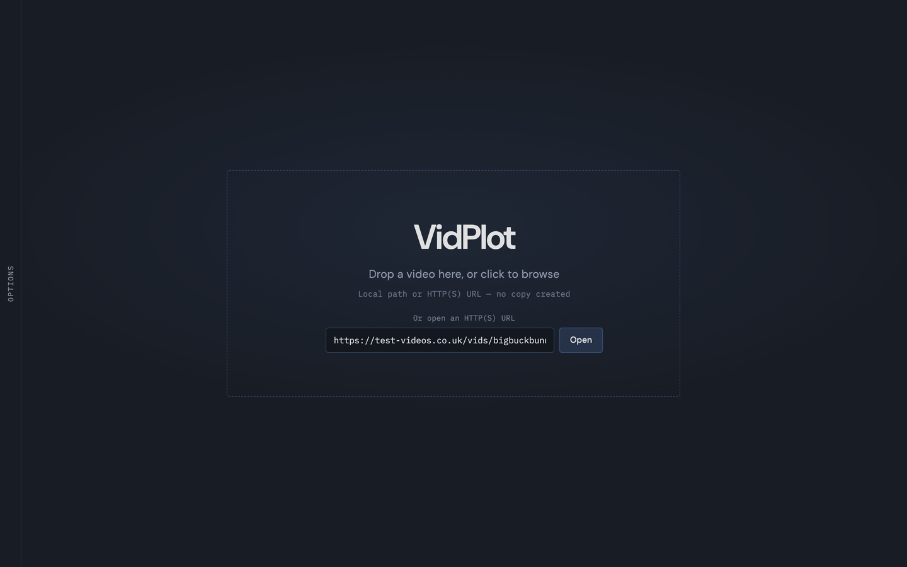

Supported types include MP4, MOV, MKV, TS, AVI, WebM, elementary H.264/H.265, **Y4M**, and raw **YUV/RAW**.

---

## 2. Main workspace

After open, the layout settles into four zones:

| Zone                        | What it is                                                   |
| --------------------------- | ------------------------------------------------------------ |
| **Preview**                 | Picture (native `<video>`, or ffmpeg→canvas for hard codecs) |
| **Scope toggles**           | Analyzers under the preview                                  |
| **Frame graph + transport** | Per-frame size bars and play/seek                            |
| **Tracks & properties**     | Stream tree and detailed metadata                            |

While a clip is open you can still drop another file anywhere, or use the **Options** tray on the left edge.

---

## 3. Analysis progress

Opening a file runs in stages: container/stream properties → frame graph (decode for I/P/B) → optional Avg QP pass.

Watch the status near the seek bar. Long HEVC or broadcast files can take a while for the graph; that is normal.

---

## 4. Tracks & properties

**Tracks** lists video / audio / captions. Click a stream to focus it.

**Properties** shows codec, profile/level, resolution, frame rate, `pix_fmt`, color metadata, GOP size, reorder delay, frame-type counts, bit rate, encoder tags, and more.

Drag the vertical splitter to resize the rail; use **Fold** (or `]`) to collapse it.

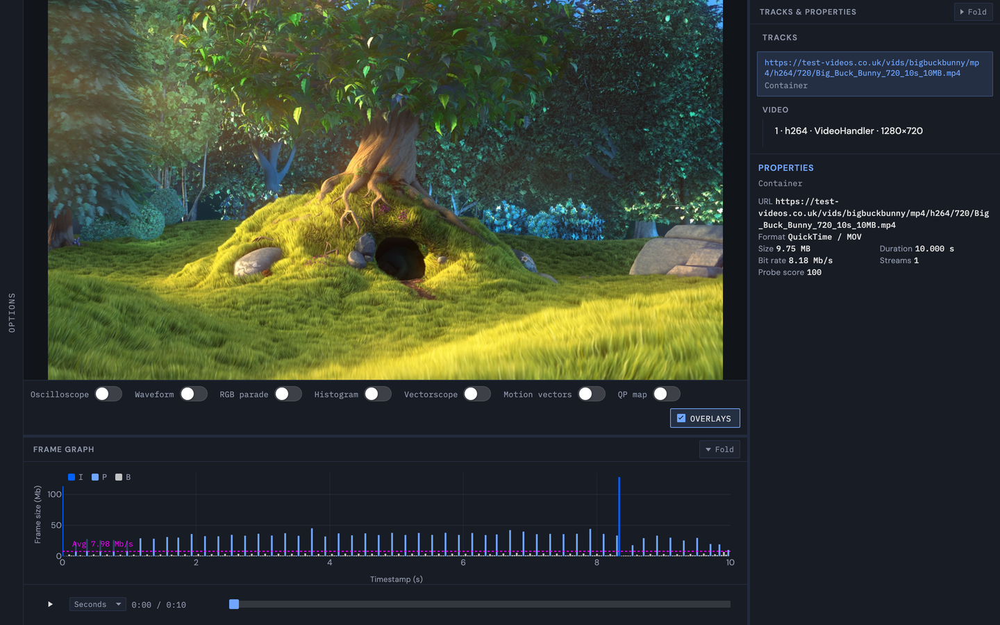

---

## 5. Frame graph

Bars are **size in Mb/s**, colored **I / P / B**. The playhead stays synced with the preview.

- **Hover** a bar → frame index, timecode, DTS/PTS, size, type, Avg QP (when available).
- **Click / drag** on the graph to seek.
- **Zoom** into a short GOP or spike (`+` / `-` when focus is not in a text field).
- **Fold** the graph with the panel button (or `g`).

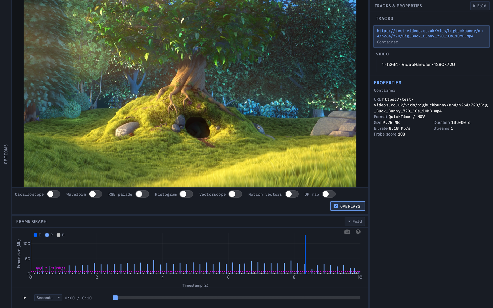

---

## 6. Transport & time display

Under the graph:

- **Play / Pause** (also **Space** / **K**)
- **Seek bar**
- **Time mode** dropdown: Seconds · Timecode · Timestamp · Frames

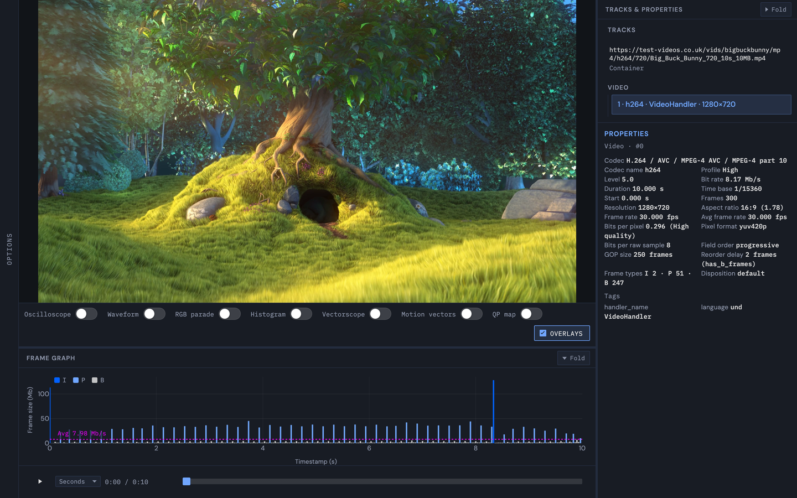

### Keyboard (when not typing in a field)

| Keys                             | Action                                 |
| -------------------------------- | -------------------------------------- |
| **J / K / L**                    | Shuttle back / pause / shuttle forward |
| **Space**                        | Play / pause                           |
| **,** / **.** (or **<** / **>**) | Step one frame                         |
| **←** / **→**                    | Seek ±1 s                              |

---

## 7. Scopes (analyzers)

Under the preview, toggle:

| Scope          | Use it for                                      |
| -------------- | ----------------------------------------------- |
| Oscilloscope   | Level trace along a line                        |
| Waveform       | Luma vs column (exposure, crush, clip)          |
| RGB parade     | Channel balance                                 |
| Histogram      | R/G/B level distribution                        |
| Vectorscope    | Chroma (U vs V), saturation                     |
| Motion vectors | codecview MVs (codec-dependent)                 |
| QP map         | Per-macroblock QP tint + grid (H.264/VP9, etc.) |

**Overlays** shows or hides the live PiP of the picture and the axis legend on top of scopes.

Scopes update for the **current frame**. Hard codecs (for example ProRes) use the ffmpeg preview path so scrubbing and scopes still work when the browser cannot decode natively.

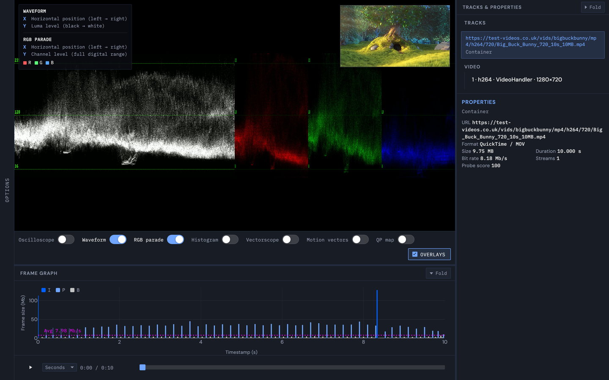

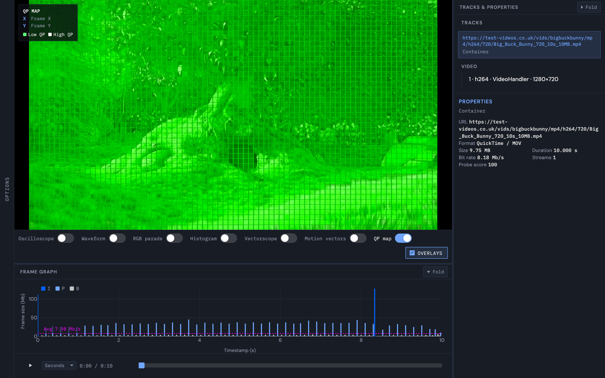

---

## 8. Options tray

Open **Options** from the left-edge tab.

- **Load new video** — browse, drop, or URL
- **Compare with another video** — starts wipe-compare (once a clip is open)
- **ffprobe / ffmpeg paths** — if binaries are not on `PATH`
- Shortcut cheat sheet in the tray

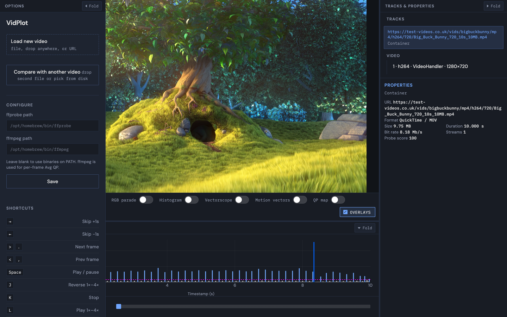

---

## 9. Load another file (replace vs compare)

With a clip already open, drop or pick a second file. VidPlot asks:

- **Load new video** — replace the current clip
- **Compare with existing** — wipe-compare

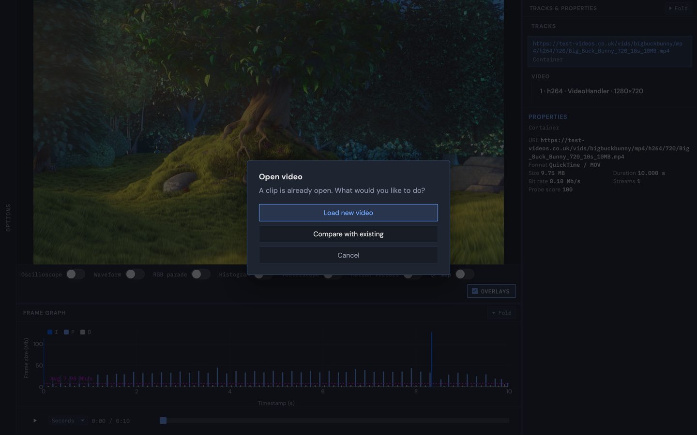

---

## 10. Raw / uncompressed open

| Extension           | Behavior                                                 |
| ------------------- | -------------------------------------------------------- |
| `.y4m`              | Size, rate, and pixel format from the header (no prompt) |
| `.yuv` **/** `.raw` | Dialog for pixel format, frame rate, and width × height  |

Presets are offered; custom values work. Last-used params are remembered. Preview always uses ffmpeg→canvas. Raw graph bars are usually flat (fixed frame bytes); QP / motion-vector scopes usually do not apply.

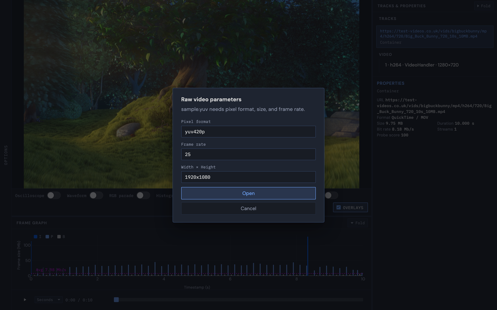

---

## 11. Wipe compare

Enter compare via the load dialog or **Compare with another video** in Options.

- **Vertical** or **Horizontal** wipe
- Drag the **divider**
- **Click** a side (A or B) to drive Tracks, properties, and the frame graph from that slot
- **Scroll** to zoom; drag to pan; **double-click** for fullscreen
- Scopes apply to **both** pictures at the shared timeline
- **End compare** returns to single-clip mode

---

## 12. B frame offset (compare lock)

When both clips have presentation timestamps ready, the toolbar shows **B offset**.

- **−1 / +1** or type an integer: “B is N frames later than A”
- **Alt+← / Alt+→** nudges the offset
- **A is index-truth**; each side seeks on its own PTS table (handles `start_time` differences and native vs ffmpeg preview rounding)
- While playing, sync is approximate; **pause** re-asserts a frame-exact lock
- If timestamps are not ready yet, the control stays disabled and says so (it does not silently fall back to a pure time offset)

Useful for source vs super-resolution (or any pipeline delay) without bouncing between players.

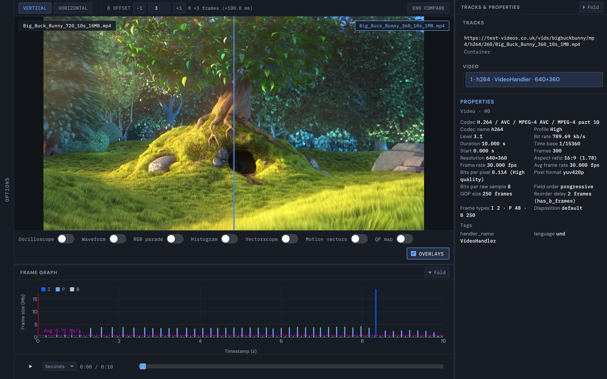

---

## 13. Layout

| Key   | Action                            |
| ----- | --------------------------------- |
| **]** | Fold / expand Tracks & properties |
| **g** | Fold / expand Frame graph         |

Drag the horizontal splitter between preview and graph, and the vertical splitter beside the properties rail.

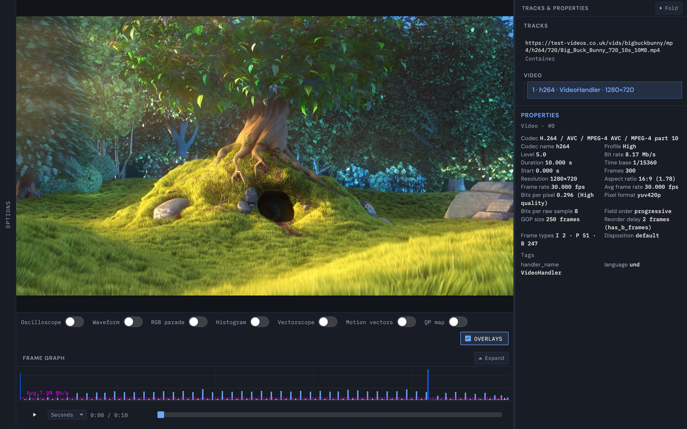

---

## Quick recipe

1. Drop an encode (or open a URL).
2. Skim **properties** (codec, level, `pix_fmt`, GOP).
3. Find a spike on the **frame graph**, zoom in, hover for PTS / type / QP.
4. Toggle **waveform** or **QP map** on that frame.
5. Drop a second clip → **Compare** → wipe → set **B offset** until the pictures lock.
6. Step frames with **,** / **.** and confirm the wipe still matches.

That is the loop VidPlot was built for: one window, full picture.

---

